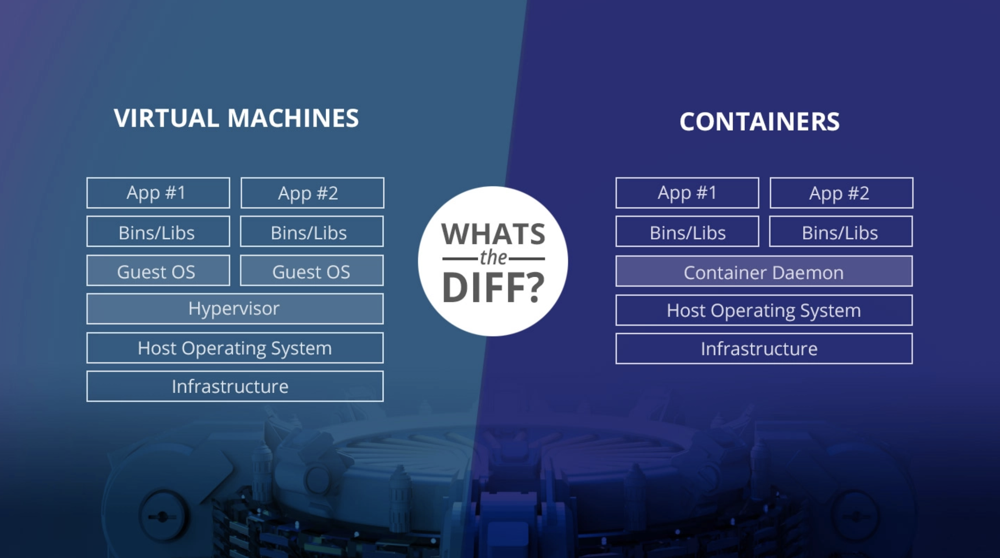

### Introduction

####What is Docker?  

Wikipedia defines Docker as

````
an open-source project that automates the deployment of software applications inside containers by providing an additional layer of abstraction and automation of OS-level virtualization on Linux.
````

#### What are containers?  
The industry standard today is to use Virtual Machines (VMs) to run software applications. VMs run applications inside a guest Operating System, which runs on virtual hardware powered by the server’s host OS.

VMs are great at providing full process isolation for applications: there are very few ways a problem in the host operating system can affect the software running in the guest operating system, and vice-versa. But this isolation comes at great cost — the computational overhead spent virtualizing hardware for a guest OS to use is substantial.

Containers take a different approach: by leveraging the low-level mechanics of the host operating system, containers provide most of the isolation of virtual machines at a fraction of the computing power.


#### Why use containers?
Containers offer a logical packaging mechanism in which applications can be abstracted from the environment in which they actually run. This decoupling allows container-based applications to be deployed easily and consistently, regardless of whether the target environment is a private data center, the public cloud, or even a developer’s personal laptop. This gives developers the ability to create predictable environments that are isolated from the rest of the applications and can be run anywhere.


#### Virtual Machines vs. Containers
At the end of the day, containers are simply processes running on the host. They don't require running a Hypervisor (such as VMWare or VirtualBox) as VMs do, which means there’s no guest operating system to lug around. Virtual Machines still have there use, but they solve a different set of problems than Docker. You can use Docker to isolate individual applications, and use Virtual Machines to isolate entire systems. They are operating at different levels of abstraction.


#### Virtual Machines vs. Containers Visualized
